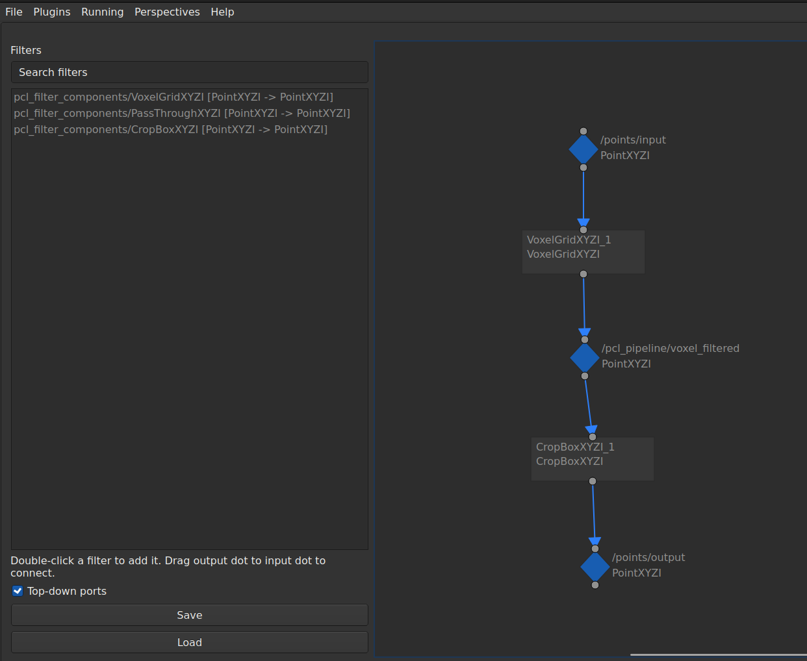

# pcl_filter_editor

`pcl_filter_editor` installs the `PCL Pipeline Editor` rqt plugin and the
editor-side graph/discovery Python modules.

The editor discovers filters from concrete point-type packages and logical types
from both concrete point-type packages and `pcl_filter_type_adapters`. It saves
YAML graph files containing layout orientation, topics, ports, QoS settings,
sync settings, parameters, and component identity.
